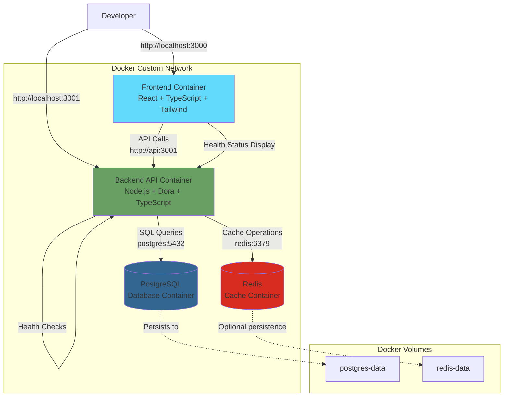
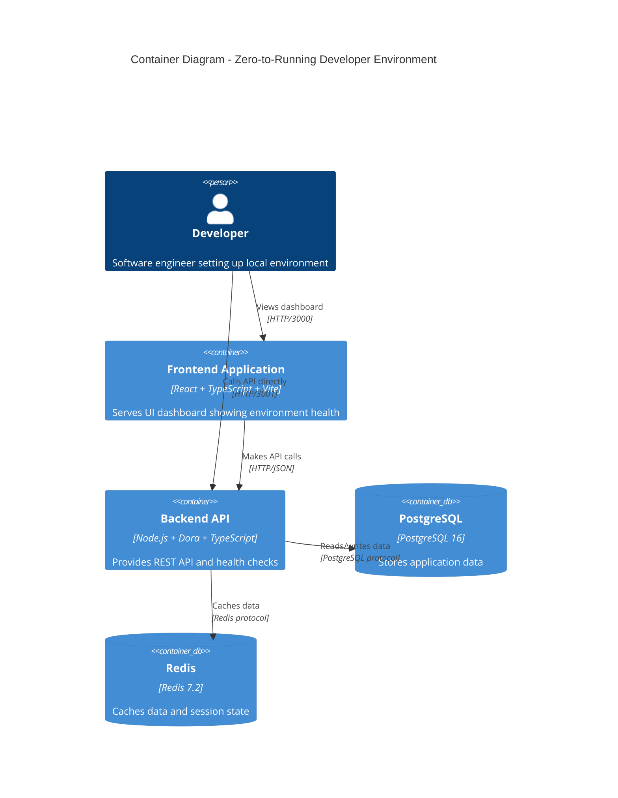
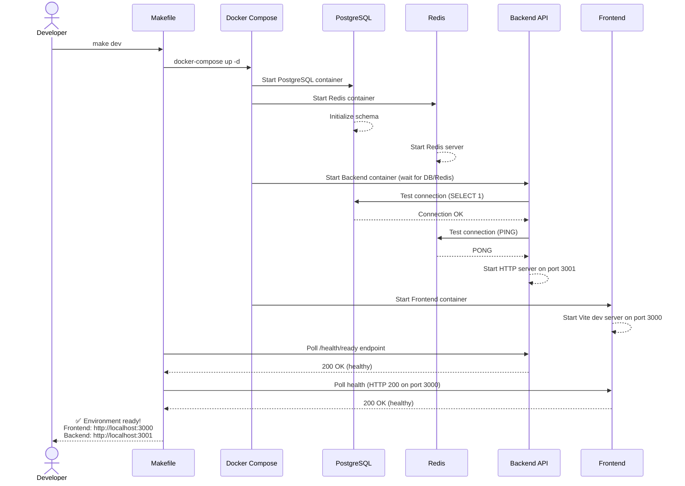
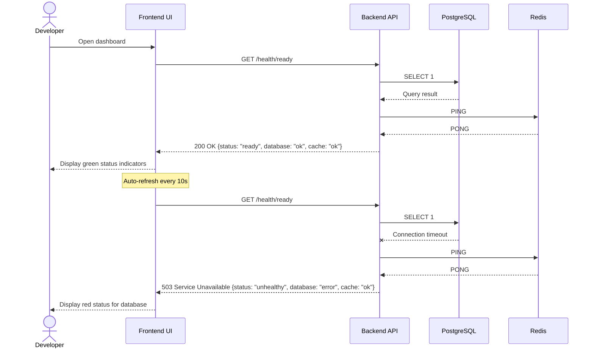
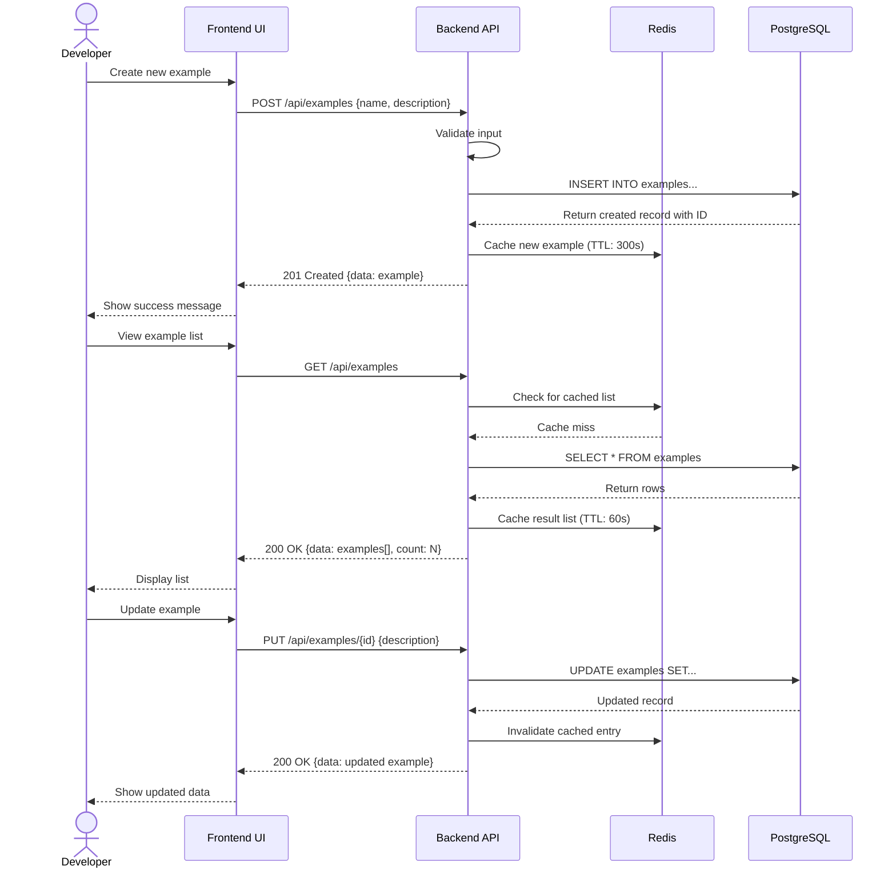
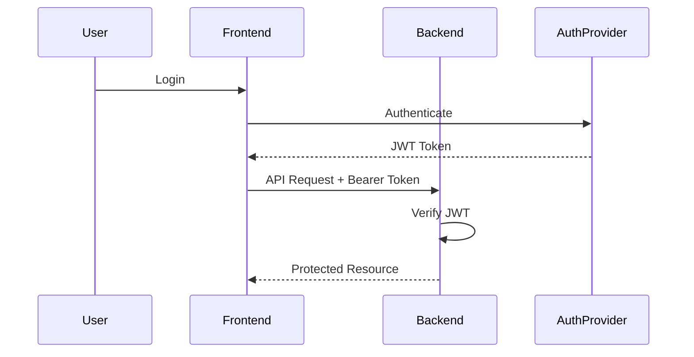
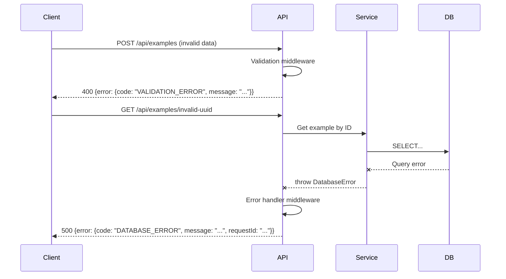

# Zero-to-Running Developer Environment Fullstack Architecture Document

## Introduction

This document outlines the complete fullstack architecture for Zero-to-Running Developer Environment, including backend systems, frontend implementation, and their integration. It serves as the single source of truth for AI-driven development, ensuring consistency across the entire technology stack.

This unified approach combines what would traditionally be separate backend and frontend architecture documents, streamlining the development process for modern fullstack applications where these concerns are increasingly intertwined.

### Starter Template or Existing Project

**N/A - Greenfield project**

This is a greenfield project designed to be a reference implementation for containerized multi-service development environments. No existing starter templates are being used. Instead, we're building from scratch using Docker Compose for local orchestration and establishing patterns that can be deployed to Kubernetes/GKE for production scenarios.

The architecture will be optimized for:
- Developer experience (single command setup)
- Production readiness (demonstrating best practices)
- Educational value (teaching containerization and orchestration)

### Change Log

| Date | Version | Description | Author |
|------|---------|-------------|--------|
| 2025-11-10 | 1.0 | Initial architecture document creation | Winston (Architect) |

## High Level Architecture

### Technical Summary

The Zero-to-Running Developer Environment implements a containerized microservices architecture using Docker Compose for local orchestration with Kubernetes/GKE as the production deployment target. The system consists of four primary services: a React/TypeScript/Tailwind CSS frontend, a Node.js/TypeScript/Dora backend API, PostgreSQL database, and Redis cache. All services communicate via a custom Docker network with DNS-based service discovery, enabling the "single command" developer experience that is central to the PRD goals. The architecture emphasizes developer productivity through hot reload, exposed debug ports, comprehensive health checks, and intelligent startup orchestration. This design achieves the PRD's core objective of sub-10-minute environment setup while demonstrating production-ready patterns for secret management, observability, and service orchestration.

### Platform and Infrastructure Choice

**Platform:** Docker Compose (Local Development) / Google Kubernetes Engine (Production Deployment)

**Rationale:** Docker Compose provides the optimal balance for local development environments - it's widely adopted, has excellent cross-platform support (macOS, Linux, Windows/WSL2), and offers simple declarative configuration. For production, GKE provides enterprise-grade Kubernetes hosting with excellent integration with Google Cloud services, autoscaling, and managed control plane. This dual-platform approach allows developers to work locally with lightweight tooling while maintaining production parity through containerization.

**Key Services:**
- **Docker Compose** - Local service orchestration
- **GKE (Google Kubernetes Engine)** - Production Kubernetes hosting
- **Cloud SQL for PostgreSQL** - Managed PostgreSQL for production
- **Memorystore for Redis** - Managed Redis for production
- **Google Container Registry (GCR)** - Container image storage
- **Cloud Build** - CI/CD pipeline for container builds
- **Cloud Load Balancing** - External traffic distribution

**Deployment Host and Regions:**
- **Development:** Local developer machines (macOS, Linux, Windows/WSL2)
- **Production:** GKE clusters in `us-central1` (primary) with multi-region expansion capability

### Repository Structure

**Structure:** Monorepo

**Monorepo Tool:** npm workspaces (native to Node.js, zero additional dependencies)

**Package Organization:**
- `apps/web` - Frontend React application
- `apps/api` - Backend Node.js/Dora API
- `packages/shared` - Shared TypeScript types, interfaces, and utilities
- `infrastructure/` - Docker Compose configs, Kubernetes manifests, database migrations

**Rationale:** A monorepo structure aligns perfectly with the "Zero-to-Running" philosophy by consolidating all code in one place. npm workspaces provides native monorepo support without additional tooling complexity (avoiding Nx, Turborepo, etc.), which keeps the learning curve gentle for developers new to monorepos. This structure enables code sharing between frontend and backend (especially TypeScript types), simplifies versioning, and ensures atomic commits across the full stack.

### High Level Architecture Diagram



### Architectural Patterns

- **Containerized Microservices:** Each service runs in an isolated Docker container with explicit dependencies and networking - _Rationale:_ Ensures "works on my machine" problems are eliminated through consistent containerized environments while enabling independent scaling and deployment of services in production.

- **Service Orchestration with Health-Based Startup:** Docker Compose manages service dependencies and startup ordering with custom health check verification - _Rationale:_ Achieves the single-command startup experience while ensuring all services are truly ready (not just "running") before declaring success.

- **Component-Based UI with TypeScript:** React components with strict TypeScript typing and Tailwind for utility-first styling - _Rationale:_ Type safety reduces runtime errors, React's component model promotes reusability, and Tailwind enables rapid UI development without CSS file proliferation.

- **RESTful API with OpenAPI Documentation:** Standard REST API with auto-generated OpenAPI/Swagger documentation - _Rationale:_ REST is widely understood, well-supported, and appropriate for the simple CRUD operations this reference implementation needs; OpenAPI provides interactive documentation for developers.

- **Repository Pattern for Data Access:** Abstract database operations behind repository interfaces - _Rationale:_ Decouples business logic from data access, enables easier testing with mocks, and provides flexibility for future database changes.

- **Environment-Based Configuration:** All configuration via environment variables with `.env` files - _Rationale:_ Follows 12-factor app principles, enables easy customization without code changes, and demonstrates production-ready secret management patterns.

- **Structured Logging:** JSON-formatted logs with consistent fields across all services - _Rationale:_ Enables log aggregation and analysis, supports debugging in development and monitoring in production.

- **Infrastructure as Code:** All infrastructure defined in version-controlled files (docker-compose.yml, Kubernetes manifests) - _Rationale:_ Makes infrastructure reproducible, reviewable, and version-controlled just like application code.

## Tech Stack

### Technology Stack Table

| Category | Technology | Version | Purpose | Rationale |
|----------|-----------|---------|---------|-----------|
| Frontend Language | TypeScript | 5.3+ | Type-safe frontend development | Provides compile-time type checking, excellent IDE support, and reduces runtime errors significantly |
| Frontend Framework | React | 18.2+ | UI component library | Industry standard with massive ecosystem, excellent hot reload, and component reusability |
| UI Component Library | Tailwind CSS | 3.4+ | Utility-first CSS framework | Rapid UI development without writing custom CSS, excellent developer experience, small production bundle |
| State Management | React Context + Hooks | Built-in | Application state management | Built into React, no additional dependencies, sufficient for the simple state needs of this reference app |
| Frontend Build Tool | Vite | 5.0+ | Frontend build and dev server | Lightning-fast hot reload, optimal for React + TypeScript, modern ESM-based architecture |
| Backend Language | TypeScript | 5.3+ | Type-safe backend development | Shared language with frontend enables code reuse, type safety throughout the stack |
| Backend Framework | Dora | 1.x | Lightweight Node.js framework | Minimalist routing framework as specified in PRD, simple to understand for reference implementation |
| Backend Runtime | Node.js | 20 LTS | JavaScript runtime | LTS version provides stability, widely supported, excellent npm ecosystem |
| API Style | REST | - | API communication pattern | Simple, well-understood, appropriate for CRUD operations; uses standard HTTP methods |
| API Documentation | OpenAPI/Swagger | 3.0 | API specification and docs | Interactive documentation, auto-generated from code, industry standard |
| Database | PostgreSQL | 16 | Relational database | Rock-solid RDBMS, excellent Docker support, ACID compliance, rich feature set |
| Database Client | node-postgres (pg) | 8.11+ | PostgreSQL client library | Official Node.js PostgreSQL client, connection pooling, promise-based API |
| Database Migrations | node-pg-migrate | 7.0+ | Schema migration management | Simple migration tool, works well with node-postgres, SQL-based migrations |
| Cache | Redis | 7.2 | In-memory cache and session store | Industry standard caching, excellent performance, simple key-value operations |
| Redis Client | ioredis | 5.3+ | Redis client library | Robust Redis client with Promise support, cluster support, good error handling |
| Container Runtime | Docker | 24+ | Containerization platform | Industry standard, cross-platform support, excellent local development experience |
| Local Orchestration | Docker Compose | 2.23+ | Multi-container orchestration | Declarative service definition, dependency management, perfect for local development |
| Production Orchestration | Kubernetes (GKE) | 1.28+ | Container orchestration at scale | Production-grade orchestration, auto-scaling, self-healing, managed by GKE |
| Frontend Testing | Vitest + React Testing Library | Vitest 1.0+, RTL 14+ | Unit and component testing | Fast test runner (built into Vite), RTL promotes good testing practices |
| Backend Testing | Jest | 29+ | Unit and integration testing | Industry standard, excellent mocking support, works well with TypeScript |
| E2E Testing | Playwright | 1.40+ | End-to-end browser testing | Cross-browser support, excellent developer experience, auto-wait functionality |
| Code Quality | ESLint + Prettier | ESLint 8+, Prettier 3+ | Linting and formatting | Enforces code standards, automatic formatting, TypeScript-aware |
| Build Automation | Make | GNU Make 4+ | Task runner for development commands | Cross-platform, simple syntax, perfect for wrapping Docker Compose commands |
| CI/CD | GitHub Actions | - | Continuous integration and deployment | Integrated with GitHub, free for public repos, extensive action marketplace |
| Container Registry | Google Container Registry | - | Docker image storage | Integrated with GKE, secure, private image hosting |
| IaC Tool | Kubernetes YAML + Kustomize | - | Infrastructure definition | Native Kubernetes manifests with Kustomize for environment-specific overlays |
| Monitoring | Prometheus + Grafana | Prometheus 2.45+, Grafana 10+ | Metrics collection and visualization | Industry standard observability stack, rich ecosystem, powerful querying |
| Logging | Winston | 3.11+ | Application logging | Structured JSON logging, multiple transports, widely used in Node.js |
| Error Tracking | Sentry | 7.0+ | Error monitoring and alerting | Excellent error tracking, source map support, integrates with monitoring |

## Data Models

Since this is a reference implementation focused on developer environment setup rather than a specific business domain, we'll define minimal data models that demonstrate the patterns while keeping the implementation straightforward.

### HealthCheck

**Purpose:** Represents the health status of a service and its dependencies. Used by the backend health endpoints to communicate service readiness.

**Key Attributes:**
- `status`: string - Overall health status ('ok', 'ready', 'unhealthy')
- `timestamp`: Date - When the health check was performed
- `database`: string (optional) - Database connection status
- `cache`: string (optional) - Redis cache status
- `version`: string (optional) - API version information

#### TypeScript Interface

```typescript
interface HealthCheckResponse {
  status: 'ok' | 'ready' | 'unhealthy';
  timestamp: string; // ISO 8601 format
  database?: 'ok' | 'error';
  cache?: 'ok' | 'error';
  version?: string;
  uptime?: number; // seconds
}
```

#### Relationships

- No relationships - this is a status DTO

### ServiceConfig

**Purpose:** Represents the configuration for a service including all environment variables and connection settings. Demonstrates the configuration management pattern.

**Key Attributes:**
- `port`: number - Service listening port
- `nodeEnv`: string - Environment (development, staging, production)
- `logLevel`: string - Logging verbosity
- `databaseUrl`: string - PostgreSQL connection string
- `redisUrl`: string - Redis connection string

#### TypeScript Interface

```typescript
interface ServiceConfig {
  port: number;
  nodeEnv: 'development' | 'staging' | 'production';
  logLevel: 'debug' | 'info' | 'warn' | 'error';
  database: {
    host: string;
    port: number;
    database: string;
    user: string;
    password: string;
    maxConnections: number;
  };
  redis: {
    host: string;
    port: number;
    password?: string;
  };
  cors: {
    origin: string | string[];
  };
}
```

#### Relationships

- No relationships - this is a configuration object

### Example

**Purpose:** Simple domain entity to demonstrate CRUD operations, database persistence, and API patterns. Can be extended for specific use cases.

**Key Attributes:**
- `id`: string (UUID) - Unique identifier
- `name`: string - Entity name
- `description`: string - Entity description
- `createdAt`: Date - Creation timestamp
- `updatedAt`: Date - Last update timestamp

#### TypeScript Interface

```typescript
interface Example {
  id: string; // UUID
  name: string;
  description: string;
  createdAt: Date;
  updatedAt: Date;
}

interface CreateExampleDTO {
  name: string;
  description: string;
}

interface UpdateExampleDTO {
  name?: string;
  description?: string;
}
```

#### Relationships

- No relationships in minimal version - can be extended with foreign keys as needed

## API Specification

### REST API Specification

```yaml
openapi: 3.0.0
info:
  title: Zero-to-Running Developer Environment API
  version: 1.0.0
  description: |
    Reference REST API demonstrating health checks, CRUD operations, and best practices
    for containerized Node.js applications.
servers:
  - url: http://localhost:3001
    description: Local development server
  - url: http://api:3001
    description: Docker internal network

paths:
  /health:
    get:
      summary: Basic health check
      description: Returns simple health status to verify API is running
      tags:
        - Health
      responses:
        '200':
          description: Service is healthy
          content:
            application/json:
              schema:
                type: object
                properties:
                  status:
                    type: string
                    example: ok
                  timestamp:
                    type: string
                    format: date-time
                  version:
                    type: string
                    example: 1.0.0
                  uptime:
                    type: number
                    description: Server uptime in seconds

  /health/ready:
    get:
      summary: Readiness health check
      description: Verifies all dependencies (database, cache) are accessible
      tags:
        - Health
      responses:
        '200':
          description: Service and all dependencies are ready
          content:
            application/json:
              schema:
                type: object
                properties:
                  status:
                    type: string
                    example: ready
                  timestamp:
                    type: string
                    format: date-time
                  database:
                    type: string
                    example: ok
                  cache:
                    type: string
                    example: ok
        '503':
          description: Service or dependencies are not ready
          content:
            application/json:
              schema:
                type: object
                properties:
                  status:
                    type: string
                    example: unhealthy
                  database:
                    type: string
                    example: error
                  cache:
                    type: string
                    example: ok
                  error:
                    type: string

  /api/examples:
    get:
      summary: List all examples
      description: Retrieve all example entities from the database
      tags:
        - Examples
      responses:
        '200':
          description: List of examples
          content:
            application/json:
              schema:
                type: object
                properties:
                  data:
                    type: array
                    items:
                      $ref: '#/components/schemas/Example'
                  count:
                    type: number

    post:
      summary: Create new example
      description: Create a new example entity
      tags:
        - Examples
      requestBody:
        required: true
        content:
          application/json:
            schema:
              $ref: '#/components/schemas/CreateExampleDTO'
      responses:
        '201':
          description: Example created successfully
          content:
            application/json:
              schema:
                type: object
                properties:
                  data:
                    $ref: '#/components/schemas/Example'
        '400':
          description: Invalid request data
          content:
            application/json:
              schema:
                $ref: '#/components/schemas/Error'

  /api/examples/{id}:
    get:
      summary: Get example by ID
      tags:
        - Examples
      parameters:
        - name: id
          in: path
          required: true
          schema:
            type: string
            format: uuid
      responses:
        '200':
          description: Example found
          content:
            application/json:
              schema:
                type: object
                properties:
                  data:
                    $ref: '#/components/schemas/Example'
        '404':
          description: Example not found
          content:
            application/json:
              schema:
                $ref: '#/components/schemas/Error'

    put:
      summary: Update example
      tags:
        - Examples
      parameters:
        - name: id
          in: path
          required: true
          schema:
            type: string
            format: uuid
      requestBody:
        required: true
        content:
          application/json:
            schema:
              $ref: '#/components/schemas/UpdateExampleDTO'
      responses:
        '200':
          description: Example updated
          content:
            application/json:
              schema:
                type: object
                properties:
                  data:
                    $ref: '#/components/schemas/Example'
        '404':
          description: Example not found

    delete:
      summary: Delete example
      tags:
        - Examples
      parameters:
        - name: id
          in: path
          required: true
          schema:
            type: string
            format: uuid
      responses:
        '204':
          description: Example deleted successfully
        '404':
          description: Example not found

components:
  schemas:
    Example:
      type: object
      properties:
        id:
          type: string
          format: uuid
        name:
          type: string
        description:
          type: string
        createdAt:
          type: string
          format: date-time
        updatedAt:
          type: string
          format: date-time

    CreateExampleDTO:
      type: object
      required:
        - name
        - description
      properties:
        name:
          type: string
          minLength: 1
          maxLength: 255
        description:
          type: string
          maxLength: 1000

    UpdateExampleDTO:
      type: object
      properties:
        name:
          type: string
          minLength: 1
          maxLength: 255
        description:
          type: string
          maxLength: 1000

    Error:
      type: object
      properties:
        error:
          type: object
          properties:
            code:
              type: string
            message:
              type: string
            details:
              type: object
            timestamp:
              type: string
              format: date-time
            requestId:
              type: string
```

## Components

### Frontend Service

**Responsibility:** Serves the React-based user interface, handles client-side routing, state management, and API communication. Provides the dashboard showing environment health status.

**Key Interfaces:**
- HTTP server on port 3000 (configurable)
- REST API client calling backend on port 3001
- WebSocket connection for real-time health updates (future enhancement)

**Dependencies:** Backend API service for data and health checks

**Technology Stack:**
- Vite dev server for local development with HMR
- React 18 with TypeScript for UI components
- Tailwind CSS for styling
- React Router for client-side routing
- Fetch API for backend communication

### Backend API Service

**Responsibility:** Exposes REST API endpoints, implements business logic, manages database connections, handles caching, and provides health check endpoints. Core orchestrator between frontend and data layers.

**Key Interfaces:**
- REST API on port 3001 (configurable)
- `/health` and `/health/ready` endpoints
- `/api/examples` CRUD endpoints
- PostgreSQL connection via node-postgres
- Redis connection via ioredis

**Dependencies:** PostgreSQL database, Redis cache

**Technology Stack:**
- Node.js 20 runtime
- Dora framework for routing
- TypeScript for type safety
- Winston for structured logging
- node-postgres for database access
- ioredis for cache access

### PostgreSQL Database Service

**Responsibility:** Persistent storage for application data, provides ACID transactions, handles schema migrations, and maintains data integrity.

**Key Interfaces:**
- PostgreSQL protocol on port 5432 (configurable)
- SQL interface for queries and transactions
- Docker volume mount for data persistence

**Dependencies:** None (foundational service)

**Technology Stack:**
- PostgreSQL 16 official Docker image
- Initialization scripts for schema setup
- pg_dump for backups

### Redis Cache Service

**Responsibility:** In-memory caching for frequently accessed data, session storage, and temporary data. Improves API response times and reduces database load.

**Key Interfaces:**
- Redis protocol on port 6379 (configurable)
- Key-value storage with TTL support
- Pub/sub for real-time notifications (future enhancement)

**Dependencies:** None (foundational service)

**Technology Stack:**
- Redis 7.2 official Docker image
- Optional RDB persistence
- redis-cli for debugging

### Orchestration Layer (Make + Docker Compose)

**Responsibility:** Manages service lifecycle, coordinates startup/shutdown, performs health checks, and provides developer-friendly commands. Implements the "single command" experience.

**Key Interfaces:**
- Makefile targets: `dev`, `down`, `logs`, `status`, `seed`
- Docker Compose for service orchestration
- Health check polling scripts

**Dependencies:** All services

**Technology Stack:**
- GNU Make for command abstraction
- Docker Compose for multi-container orchestration
- Shell scripts for health validation

### Component Diagrams



## External APIs

**No external APIs required.**

This is a self-contained reference implementation that does not integrate with external third-party APIs. All functionality is provided by the four internal services (frontend, backend, database, cache).

Future enhancements could integrate external services such as:
- Authentication providers (Auth0, Firebase Auth)
- Monitoring services (Datadog, New Relic)
- Email services (SendGrid, Mailgun)
- Cloud storage (S3, Google Cloud Storage)

## Core Workflows

### Service Startup Workflow



### Health Check Workflow



### Example CRUD Workflow



## Database Schema

```sql
-- Database initialization script
-- This creates the schema for the example application

-- Enable UUID extension
CREATE EXTENSION IF NOT EXISTS "uuid-ossp";

-- Examples table (demonstrates basic CRUD)
CREATE TABLE examples (
    id UUID PRIMARY KEY DEFAULT uuid_generate_v4(),
    name VARCHAR(255) NOT NULL,
    description TEXT,
    created_at TIMESTAMP WITH TIME ZONE DEFAULT CURRENT_TIMESTAMP,
    updated_at TIMESTAMP WITH TIME ZONE DEFAULT CURRENT_TIMESTAMP
);

-- Index for faster lookups by name
CREATE INDEX idx_examples_name ON examples(name);

-- Index for sorting by creation date
CREATE INDEX idx_examples_created_at ON examples(created_at DESC);

-- Trigger to automatically update updated_at timestamp
CREATE OR REPLACE FUNCTION update_updated_at_column()
RETURNS TRIGGER AS $$
BEGIN
    NEW.updated_at = CURRENT_TIMESTAMP;
    RETURN NEW;
END;
$$ language 'plpgsql';

CREATE TRIGGER update_examples_updated_at
    BEFORE UPDATE ON examples
    FOR EACH ROW
    EXECUTE FUNCTION update_updated_at_column();

-- Seed data (optional, controlled by environment variable)
-- INSERT INTO examples (name, description) VALUES
--     ('Example 1', 'First example demonstrating database persistence'),
--     ('Example 2', 'Second example showing CRUD operations'),
--     ('Example 3', 'Third example for testing list endpoints');

-- Migration tracking table (for node-pg-migrate)
CREATE TABLE IF NOT EXISTS pgmigrations (
    id SERIAL PRIMARY KEY,
    name VARCHAR(255) NOT NULL UNIQUE,
    run_on TIMESTAMP WITH TIME ZONE DEFAULT CURRENT_TIMESTAMP
);
```

**Schema Design Notes:**
- UUID primary keys for distributed system compatibility
- Automatic timestamp management with triggers
- Indexes on commonly queried fields
- Migration tracking for schema version control
- Seed data commented out (controlled by `make seed` command)

## Frontend Architecture

### Component Architecture

#### Component Organization

```
apps/web/src/
├── components/          # Reusable UI components
│   ├── common/         # Generic components (Button, Card, etc.)
│   ├── health/         # Health status components
│   └── examples/       # Example-specific components
├── pages/              # Page-level components (routes)
│   ├── Dashboard.tsx   # Main dashboard showing health status
│   └── Examples.tsx    # Examples CRUD page
├── hooks/              # Custom React hooks
│   ├── useHealth.ts    # Health check polling hook
│   └── useApi.ts       # API client hook
├── services/           # API client services
│   ├── api.ts          # Base API client configuration
│   ├── healthService.ts
│   └── examplesService.ts
├── types/              # Frontend-specific types (imports from packages/shared)
├── styles/             # Global styles and Tailwind config
├── utils/              # Frontend utilities
├── App.tsx             # Root component
└── main.tsx            # Application entry point
```

#### Component Template

```typescript
// apps/web/src/components/health/HealthStatusCard.tsx
import React from 'react';
import { HealthCheckResponse } from '@zero-to-running/shared';

interface HealthStatusCardProps {
  service: string;
  status: HealthCheckResponse;
  isLoading: boolean;
}

export const HealthStatusCard: React.FC<HealthStatusCardProps> = ({
  service,
  status,
  isLoading,
}) => {
  const getStatusColor = () => {
    if (isLoading) return 'bg-gray-300';
    if (status.status === 'ready' || status.status === 'ok') return 'bg-green-500';
    return 'bg-red-500';
  };

  return (
    <div className="bg-white rounded-lg shadow p-6">
      <div className="flex items-center justify-between">
        <h3 className="text-lg font-semibold">{service}</h3>
        <div className={`w-4 h-4 rounded-full ${getStatusColor()}`} />
      </div>

      {!isLoading && (
        <div className="mt-4 space-y-2">
          <div className="text-sm text-gray-600">
            Status: <span className="font-medium">{status.status}</span>
          </div>
          {status.database && (
            <div className="text-sm text-gray-600">
              Database: <span className="font-medium">{status.database}</span>
            </div>
          )}
          {status.cache && (
            <div className="text-sm text-gray-600">
              Cache: <span className="font-medium">{status.cache}</span>
            </div>
          )}
          {status.uptime && (
            <div className="text-sm text-gray-600">
              Uptime: <span className="font-medium">{Math.floor(status.uptime)}s</span>
            </div>
          )}
        </div>
      )}
    </div>
  );
};
```

### State Management Architecture

#### State Structure

```typescript
// apps/web/src/context/AppContext.tsx
import React, { createContext, useContext, useState, ReactNode } from 'react';
import { HealthCheckResponse } from '@zero-to-running/shared';

interface AppState {
  backendHealth: HealthCheckResponse | null;
  isHealthLoading: boolean;
  lastChecked: Date | null;
}

interface AppContextType {
  state: AppState;
  setBackendHealth: (health: HealthCheckResponse) => void;
  setHealthLoading: (loading: boolean) => void;
}

const AppContext = createContext<AppContextType | undefined>(undefined);

export const AppProvider: React.FC<{ children: ReactNode }> = ({ children }) => {
  const [state, setState] = useState<AppState>({
    backendHealth: null,
    isHealthLoading: true,
    lastChecked: null,
  });

  const setBackendHealth = (health: HealthCheckResponse) => {
    setState(prev => ({
      ...prev,
      backendHealth: health,
      isHealthLoading: false,
      lastChecked: new Date(),
    }));
  };

  const setHealthLoading = (loading: boolean) => {
    setState(prev => ({ ...prev, isHealthLoading: loading }));
  };

  return (
    <AppContext.Provider value={{ state, setBackendHealth, setHealthLoading }}>
      {children}
    </AppContext.Provider>
  );
};

export const useApp = () => {
  const context = useContext(AppContext);
  if (!context) throw new Error('useApp must be used within AppProvider');
  return context;
};
```

#### State Management Patterns

- Use React Context for global state (health status, configuration)
- Use local component state for UI-only concerns (modals, form inputs)
- Custom hooks encapsulate state logic and side effects
- No external state management library needed (Redux, MobX) - keep it simple

### Routing Architecture

#### Route Organization

```
Routes:
/                 -> Dashboard page (health status overview)
/examples         -> Examples CRUD page
/examples/:id     -> Example detail/edit page
```

#### Protected Route Pattern

```typescript
// apps/web/src/App.tsx
import React from 'react';
import { BrowserRouter, Routes, Route } from 'react-router-dom';
import { AppProvider } from './context/AppContext';
import Dashboard from './pages/Dashboard';
import Examples from './pages/Examples';

function App() {
  return (
    <AppProvider>
      <BrowserRouter>
        <div className="min-h-screen bg-gray-100">
          <nav className="bg-white shadow-sm">
            <div className="max-w-7xl mx-auto px-4 sm:px-6 lg:px-8">
              <div className="flex justify-between h-16">
                <div className="flex items-center">
                  <h1 className="text-xl font-bold">Zero-to-Running Environment</h1>
                </div>
              </div>
            </div>
          </nav>

          <main className="max-w-7xl mx-auto py-6 sm:px-6 lg:px-8">
            <Routes>
              <Route path="/" element={<Dashboard />} />
              <Route path="/examples" element={<Examples />} />
            </Routes>
          </main>
        </div>
      </BrowserRouter>
    </AppProvider>
  );
}

export default App;
```

### Frontend Services Layer

#### API Client Setup

```typescript
// apps/web/src/services/api.ts
const API_BASE_URL = import.meta.env.VITE_API_URL || 'http://localhost:3001';

class ApiClient {
  private baseUrl: string;

  constructor(baseUrl: string) {
    this.baseUrl = baseUrl;
  }

  async request<T>(
    endpoint: string,
    options?: RequestInit
  ): Promise<T> {
    const url = `${this.baseUrl}${endpoint}`;

    const response = await fetch(url, {
      ...options,
      headers: {
        'Content-Type': 'application/json',
        ...options?.headers,
      },
    });

    if (!response.ok) {
      const error = await response.json().catch(() => ({ message: 'Request failed' }));
      throw new Error(error.message || `HTTP ${response.status}`);
    }

    return response.json();
  }

  get<T>(endpoint: string): Promise<T> {
    return this.request<T>(endpoint);
  }

  post<T>(endpoint: string, data: unknown): Promise<T> {
    return this.request<T>(endpoint, {
      method: 'POST',
      body: JSON.stringify(data),
    });
  }

  put<T>(endpoint: string, data: unknown): Promise<T> {
    return this.request<T>(endpoint, {
      method: 'PUT',
      body: JSON.stringify(data),
    });
  }

  delete<T>(endpoint: string): Promise<T> {
    return this.request<T>(endpoint, {
      method: 'DELETE',
    });
  }
}

export const apiClient = new ApiClient(API_BASE_URL);
```

#### Service Example

```typescript
// apps/web/src/services/healthService.ts
import { apiClient } from './api';
import { HealthCheckResponse } from '@zero-to-running/shared';

export const healthService = {
  async checkHealth(): Promise<HealthCheckResponse> {
    return apiClient.get<HealthCheckResponse>('/health');
  },

  async checkReadiness(): Promise<HealthCheckResponse> {
    return apiClient.get<HealthCheckResponse>('/health/ready');
  },
};

// apps/web/src/hooks/useHealth.ts
import { useState, useEffect } from 'react';
import { healthService } from '../services/healthService';
import { HealthCheckResponse } from '@zero-to-running/shared';

export const useHealth = (intervalMs: number = 10000) => {
  const [health, setHealth] = useState<HealthCheckResponse | null>(null);
  const [isLoading, setIsLoading] = useState(true);
  const [error, setError] = useState<string | null>(null);

  useEffect(() => {
    const fetchHealth = async () => {
      try {
        setIsLoading(true);
        const data = await healthService.checkReadiness();
        setHealth(data);
        setError(null);
      } catch (err) {
        setError(err instanceof Error ? err.message : 'Health check failed');
      } finally {
        setIsLoading(false);
      }
    };

    fetchHealth();
    const interval = setInterval(fetchHealth, intervalMs);

    return () => clearInterval(interval);
  }, [intervalMs]);

  return { health, isLoading, error };
};
```

## Backend Architecture

### Service Architecture

The backend uses a traditional server architecture (not serverless) with Express-like routing via the Dora framework.

#### Controller/Route Organization

```
apps/api/src/
├── routes/             # API route definitions
│   ├── index.ts       # Route aggregator
│   ├── health.ts      # Health check routes
│   └── examples.ts    # Example CRUD routes
├── controllers/        # Request handlers
│   ├── healthController.ts
│   └── examplesController.ts
├── services/          # Business logic layer
│   ├── examplesService.ts
│   └── cacheService.ts
├── repositories/      # Data access layer
│   └── examplesRepository.ts
├── middleware/        # Express middleware
│   ├── errorHandler.ts
│   ├── logger.ts
│   └── validation.ts
├── config/            # Configuration management
│   ├── database.ts
│   ├── redis.ts
│   └── env.ts
├── utils/             # Utility functions
│   └── logger.ts
└── server.ts          # Application entry point
```

#### Controller Template

```typescript
// apps/api/src/controllers/healthController.ts
import { Request, Response } from 'express';
import { db } from '../config/database';
import { redis } from '../config/redis';
import { logger } from '../utils/logger';

export const healthController = {
  async basicHealth(req: Request, res: Response) {
    res.json({
      status: 'ok',
      timestamp: new Date().toISOString(),
      version: process.env.npm_package_version || '1.0.0',
      uptime: process.uptime(),
    });
  },

  async readinessHealth(req: Request, res: Response) {
    const checks = {
      database: 'ok' as 'ok' | 'error',
      cache: 'ok' as 'ok' | 'error',
    };

    try {
      // Check database
      await db.query('SELECT 1');
    } catch (error) {
      logger.error('Database health check failed', error);
      checks.database = 'error';
    }

    try {
      // Check Redis
      await redis.ping();
    } catch (error) {
      logger.error('Redis health check failed', error);
      checks.cache = 'error';
    }

    const isHealthy = checks.database === 'ok' && checks.cache === 'ok';

    res.status(isHealthy ? 200 : 503).json({
      status: isHealthy ? 'ready' : 'unhealthy',
      timestamp: new Date().toISOString(),
      ...checks,
    });
  },
};

// apps/api/src/routes/health.ts
import { Router } from 'express';
import { healthController } from '../controllers/healthController';

const router = Router();

router.get('/health', healthController.basicHealth);
router.get('/health/ready', healthController.readinessHealth);

export default router;
```

### Database Architecture

#### Data Access Layer

```typescript
// apps/api/src/repositories/examplesRepository.ts
import { Pool } from 'pg';
import { Example, CreateExampleDTO, UpdateExampleDTO } from '@zero-to-running/shared';

export class ExamplesRepository {
  constructor(private db: Pool) {}

  async findAll(): Promise<Example[]> {
    const result = await this.db.query(
      'SELECT id, name, description, created_at as "createdAt", updated_at as "updatedAt" FROM examples ORDER BY created_at DESC'
    );
    return result.rows;
  }

  async findById(id: string): Promise<Example | null> {
    const result = await this.db.query(
      'SELECT id, name, description, created_at as "createdAt", updated_at as "updatedAt" FROM examples WHERE id = $1',
      [id]
    );
    return result.rows[0] || null;
  }

  async create(data: CreateExampleDTO): Promise<Example> {
    const result = await this.db.query(
      'INSERT INTO examples (name, description) VALUES ($1, $2) RETURNING id, name, description, created_at as "createdAt", updated_at as "updatedAt"',
      [data.name, data.description]
    );
    return result.rows[0];
  }

  async update(id: string, data: UpdateExampleDTO): Promise<Example | null> {
    const fields: string[] = [];
    const values: unknown[] = [];
    let paramCount = 1;

    if (data.name !== undefined) {
      fields.push(`name = $${paramCount++}`);
      values.push(data.name);
    }
    if (data.description !== undefined) {
      fields.push(`description = $${paramCount++}`);
      values.push(data.description);
    }

    if (fields.length === 0) {
      return this.findById(id);
    }

    values.push(id);
    const result = await this.db.query(
      `UPDATE examples SET ${fields.join(', ')} WHERE id = $${paramCount} RETURNING id, name, description, created_at as "createdAt", updated_at as "updatedAt"`,
      values
    );

    return result.rows[0] || null;
  }

  async delete(id: string): Promise<boolean> {
    const result = await this.db.query('DELETE FROM examples WHERE id = $1', [id]);
    return result.rowCount > 0;
  }
}

// apps/api/src/config/database.ts
import { Pool } from 'pg';
import { config } from './env';

export const db = new Pool({
  host: config.database.host,
  port: config.database.port,
  database: config.database.database,
  user: config.database.user,
  password: config.database.password,
  max: config.database.maxConnections,
});

db.on('error', (err) => {
  console.error('Unexpected database error', err);
  process.exit(-1);
});
```

### Authentication and Authorization

For this reference implementation, authentication is intentionally omitted to keep the focus on environment setup patterns. In a production system, this section would define:

#### Auth Flow (Future Enhancement)



#### Middleware/Guards (Future Enhancement)

```typescript
// apps/api/src/middleware/auth.ts (Not implemented in v1)
import { Request, Response, NextFunction } from 'express';
import jwt from 'jsonwebtoken';

export const authMiddleware = (req: Request, res: Response, next: NextFunction) => {
  const token = req.headers.authorization?.replace('Bearer ', '');

  if (!token) {
    return res.status(401).json({ error: { message: 'No token provided' } });
  }

  try {
    const decoded = jwt.verify(token, process.env.JWT_SECRET!);
    req.user = decoded;
    next();
  } catch (error) {
    return res.status(401).json({ error: { message: 'Invalid token' } });
  }
};
```

## Unified Project Structure

```
zero-to-running/
├── .github/                              # CI/CD and GitHub configuration
│   └── workflows/
│       ├── ci.yml                       # Continuous integration workflow
│       └── deploy.yml                   # Deployment workflow
├── apps/                                 # Application packages
│   ├── web/                             # Frontend React application
│   │   ├── public/                      # Static assets
│   │   │   └── vite.svg
│   │   ├── src/
│   │   │   ├── components/
│   │   │   │   ├── common/              # Shared UI components
│   │   │   │   ├── health/              # Health status components
│   │   │   │   └── examples/            # Example CRUD components
│   │   │   ├── pages/
│   │   │   │   ├── Dashboard.tsx
│   │   │   │   └── Examples.tsx
│   │   │   ├── hooks/
│   │   │   │   ├── useHealth.ts
│   │   │   │   └── useApi.ts
│   │   │   ├── services/
│   │   │   │   ├── api.ts
│   │   │   │   ├── healthService.ts
│   │   │   │   └── examplesService.ts
│   │   │   ├── context/
│   │   │   │   └── AppContext.tsx
│   │   │   ├── styles/
│   │   │   │   └── index.css
│   │   │   ├── utils/
│   │   │   ├── App.tsx
│   │   │   ├── main.tsx
│   │   │   └── vite-env.d.ts
│   │   ├── tests/                       # Frontend tests
│   │   │   ├── components/
│   │   │   └── integration/
│   │   ├── .env.example
│   │   ├── .env.local                   # Git-ignored
│   │   ├── Dockerfile
│   │   ├── index.html
│   │   ├── package.json
│   │   ├── tsconfig.json
│   │   ├── tsconfig.node.json
│   │   ├── vite.config.ts
│   │   └── tailwind.config.js
│   │
│   └── api/                             # Backend Node.js application
│       ├── src/
│       │   ├── routes/
│       │   │   ├── index.ts
│       │   │   ├── health.ts
│       │   │   └── examples.ts
│       │   ├── controllers/
│       │   │   ├── healthController.ts
│       │   │   └── examplesController.ts
│       │   ├── services/
│       │   │   ├── examplesService.ts
│       │   │   └── cacheService.ts
│       │   ├── repositories/
│       │   │   └── examplesRepository.ts
│       │   ├── middleware/
│       │   │   ├── errorHandler.ts
│       │   │   ├── logger.ts
│       │   │   ├── cors.ts
│       │   │   └── validation.ts
│       │   ├── config/
│       │   │   ├── database.ts
│       │   │   ├── redis.ts
│       │   │   └── env.ts
│       │   ├── utils/
│       │   │   └── logger.ts
│       │   └── server.ts                # Application entry point
│       ├── tests/                       # Backend tests
│       │   ├── unit/
│       │   ├── integration/
│       │   └── helpers/
│       ├── .env.example
│       ├── .env                         # Git-ignored
│       ├── Dockerfile
│       ├── package.json
│       ├── tsconfig.json
│       └── jest.config.js
│
├── packages/                            # Shared packages
│   ├── shared/                          # Shared types and utilities
│   │   ├── src/
│   │   │   ├── types/
│   │   │   │   ├── index.ts
│   │   │   │   ├── health.ts
│   │   │   │   ├── example.ts
│   │   │   │   └── config.ts
│   │   │   ├── constants/
│   │   │   │   └── index.ts
│   │   │   └── utils/
│   │   │       └── index.ts
│   │   ├── package.json
│   │   └── tsconfig.json
│   │
│   └── config/                          # Shared configuration
│       ├── eslint/
│       │   └── base.js
│       ├── typescript/
│       │   └── base.json
│       └── jest/
│           └── base.js
│
├── infrastructure/                      # Infrastructure as Code
│   ├── docker/
│   │   ├── docker-compose.yml          # Local development orchestration
│   │   ├── docker-compose.prod.yml     # Production-like local setup
│   │   ├── Dockerfile.web              # Frontend production build
│   │   └── Dockerfile.api              # Backend production build
│   ├── database/
│   │   ├── migrations/                 # Database migration files
│   │   │   ├── 001_initial_schema.sql
│   │   │   └── 002_add_examples_table.sql
│   │   ├── seeds/                      # Seed data scripts
│   │   │   └── dev_data.sql
│   │   └── init.sql                    # Initial schema setup
│   ├── kubernetes/                     # Kubernetes manifests for GKE
│   │   ├── base/
│   │   │   ├── namespace.yaml
│   │   │   ├── frontend-deployment.yaml
│   │   │   ├── frontend-service.yaml
│   │   │   ├── api-deployment.yaml
│   │   │   ├── api-service.yaml
│   │   │   ├── postgres-statefulset.yaml
│   │   │   ├── postgres-service.yaml
│   │   │   ├── redis-deployment.yaml
│   │   │   ├── redis-service.yaml
│   │   │   └── ingress.yaml
│   │   ├── overlays/
│   │   │   ├── development/
│   │   │   │   └── kustomization.yaml
│   │   │   ├── staging/
│   │   │   │   └── kustomization.yaml
│   │   │   └── production/
│   │   │       └── kustomization.yaml
│   │   └── kustomization.yaml
│   └── scripts/
│       ├── health-check.sh             # Health check polling script
│       ├── wait-for-services.sh        # Service readiness script
│       └── seed-db.sh                  # Database seeding script
│
├── scripts/                             # Development and build scripts
│   ├── setup.sh                        # Initial setup script
│   ├── clean.sh                        # Cleanup script
│   └── validate-env.sh                 # Environment variable validation
│
├── docs/                                # Project documentation
│   ├── prd.md                          # Product Requirements Document
│   ├── architecture.md                 # This file
│   ├── API.md                          # API documentation (generated from OpenAPI)
│   └── CONTRIBUTING.md
│
├── tests/                               # End-to-end tests
│   └── e2e/
│       ├── health.spec.ts
│       ├── examples.spec.ts
│       └── playwright.config.ts
│
├── .env.example                         # Example environment variables
├── .gitignore
├── .prettierrc
├── .eslintrc.js
├── Makefile                             # Task runner for developer commands
├── package.json                         # Root package.json for workspaces
├── package-lock.json
├── tsconfig.json                        # Root TypeScript configuration
├── README.md
└── LICENSE
```

**Key Design Decisions:**

1. **npm Workspaces:** All packages declared in root `package.json` workspaces field
2. **Shared Types:** `packages/shared` exports all TypeScript interfaces used by both frontend and backend
3. **Docker-First:** Dockerfiles in each app directory; docker-compose in infrastructure
4. **Migrations:** SQL-based migrations in `infrastructure/database/migrations`
5. **Configuration Layering:** `.env.example` templates at each level (root, apps/web, apps/api)

## Development Workflow

### Local Development Setup

#### Prerequisites

```bash
# Required software
- Docker Desktop 24+ (macOS/Windows) or Docker Engine 24+ (Linux)
- Node.js 20 LTS (recommend using nvm)
- GNU Make 4+
- Git 2.30+

# Install Node.js with nvm (recommended)
nvm install 20
nvm use 20

# Verify installations
docker --version
docker-compose --version
node --version
npm --version
make --version
```

#### Initial Setup

```bash
# Clone repository
git clone https://github.com/org/zero-to-running.git
cd zero-to-running

# Copy environment file and customize
cp .env.example .env
# Edit .env with your preferred configuration

# Install dependencies for all workspaces
npm install

# Build shared packages
npm run build --workspace=packages/shared

# Start all services
make dev

# This will:
# 1. Start PostgreSQL and Redis containers
# 2. Run database migrations
# 3. Start backend API
# 4. Start frontend dev server
# 5. Poll health endpoints until all services are ready
# 6. Display access URLs
```

#### Development Commands

```bash
# Start all services
make dev

# Start frontend only (requires API to be running)
npm run dev --workspace=apps/web

# Start backend only (requires DB and Redis)
npm run dev --workspace=apps/api

# Run tests
make test                    # All tests
make test-frontend          # Frontend tests only
make test-backend           # Backend tests only
make test-e2e               # End-to-end tests

# View logs
make logs                   # All service logs
make logs service=api       # Backend logs only
make logs service=web       # Frontend logs only

# Database operations
make seed                   # Seed database with test data
make migrate               # Run pending migrations
make reset-db              # Drop, recreate, migrate, and seed

# Service management
make down                   # Stop all services
make restart               # Restart all services
make status                # Show service health status

# Code quality
make lint                  # Run ESLint on all code
make format                # Format code with Prettier
make typecheck             # Run TypeScript compiler check

# Cleanup
make clean                 # Remove containers and volumes
make clean-all             # Full cleanup including node_modules
```

### Environment Configuration

#### Required Environment Variables

```bash
# Frontend (.env.local)
VITE_API_URL=http://localhost:3001
VITE_APP_VERSION=1.0.0

# Backend (.env)
NODE_ENV=development
PORT=3001
LOG_LEVEL=debug

# Database
DATABASE_HOST=postgres
DATABASE_PORT=5432
DATABASE_NAME=zerotorunning
DATABASE_USER=devuser
DATABASE_PASSWORD=CHANGE_ME_devpass123
DATABASE_MAX_CONNECTIONS=20

# Redis
REDIS_HOST=redis
REDIS_PORT=6379
REDIS_PASSWORD=

# CORS
CORS_ORIGIN=http://localhost:3000

# Shared
TZ=UTC
```

**Environment Variable Precedence:**
1. System environment variables (highest priority)
2. `.env.local` (git-ignored, for local overrides)
3. `.env` (git-ignored, for local config)
4. `.env.example` (committed, documentation only)

## Deployment Architecture

### Deployment Strategy

**Frontend Deployment:**
- **Platform:** Google Cloud Run (for static SPA) or GKE (for server-rendered)
- **Build Command:** `npm run build --workspace=apps/web`
- **Output Directory:** `apps/web/dist`
- **CDN/Edge:** Cloud CDN in front of Cloud Run/Load Balancer

**Backend Deployment:**
- **Platform:** GKE (Google Kubernetes Engine)
- **Build Command:** `docker build -f infrastructure/docker/Dockerfile.api`
- **Deployment Method:** Kubernetes rolling update via kubectl/kustomize

**Database Deployment:**
- **Platform:** Cloud SQL for PostgreSQL (managed service)
- **Backup Strategy:** Automated daily backups, 30-day retention
- **Migration Strategy:** Run migrations as Kubernetes Job before deployment

**Cache Deployment:**
- **Platform:** Memorystore for Redis (managed service)
- **HA Configuration:** Redis with automatic failover

### CI/CD Pipeline

```yaml
# .github/workflows/ci.yml
name: CI Pipeline

on:
  pull_request:
  push:
    branches: [main, develop]

jobs:
  test:
    runs-on: ubuntu-latest
    steps:
      - uses: actions/checkout@v4

      - name: Setup Node.js
        uses: actions/setup-node@v4
        with:
          node-version: '20'
          cache: 'npm'

      - name: Install dependencies
        run: npm ci

      - name: Lint
        run: npm run lint

      - name: Type check
        run: npm run typecheck

      - name: Build shared packages
        run: npm run build --workspace=packages/shared

      - name: Run unit tests
        run: npm run test:unit

      - name: Start services
        run: docker-compose -f infrastructure/docker/docker-compose.yml up -d

      - name: Wait for services
        run: ./infrastructure/scripts/wait-for-services.sh

      - name: Run integration tests
        run: npm run test:integration

      - name: Run E2E tests
        run: npm run test:e2e

      - name: Stop services
        run: docker-compose -f infrastructure/docker/docker-compose.yml down

  build:
    needs: test
    runs-on: ubuntu-latest
    if: github.ref == 'refs/heads/main'
    steps:
      - uses: actions/checkout@v4

      - name: Set up Docker Buildx
        uses: docker/setup-buildx-action@v3

      - name: Login to GCR
        uses: docker/login-action@v3
        with:
          registry: gcr.io
          username: _json_key
          password: ${{ secrets.GCP_SA_KEY }}

      - name: Build and push backend
        uses: docker/build-push-action@v5
        with:
          context: .
          file: infrastructure/docker/Dockerfile.api
          push: true
          tags: gcr.io/${{ secrets.GCP_PROJECT }}/zero-to-running-api:${{ github.sha }},gcr.io/${{ secrets.GCP_PROJECT }}/zero-to-running-api:latest

      - name: Build and push frontend
        uses: docker/build-push-action@v5
        with:
          context: .
          file: infrastructure/docker/Dockerfile.web
          push: true
          tags: gcr.io/${{ secrets.GCP_PROJECT }}/zero-to-running-web:${{ github.sha }},gcr.io/${{ secrets.GCP_PROJECT }}/zero-to-running-web:latest
```

### Environments

| Environment | Frontend URL | Backend URL | Purpose |
|-------------|-------------|-------------|---------|
| Development | http://localhost:3000 | http://localhost:3001 | Local development |
| Staging | https://staging.zerotorunning.dev | https://api-staging.zerotorunning.dev | Pre-production testing |
| Production | https://zerotorunning.dev | https://api.zerotorunning.dev | Live environment |

## Security and Performance

### Security Requirements

**Frontend Security:**
- **CSP Headers:** `default-src 'self'; script-src 'self' 'unsafe-inline'; style-src 'self' 'unsafe-inline'; img-src 'self' data: https:; connect-src 'self' https://api.zerotorunning.dev`
- **XSS Prevention:** React's built-in escaping, no dangerouslySetInnerHTML without sanitization
- **Secure Storage:** No sensitive data in localStorage; use httpOnly cookies for tokens (future auth)

**Backend Security:**
- **Input Validation:** Validate all request payloads using schema validation (Joi/Zod)
- **Rate Limiting:** 100 requests/minute per IP for API endpoints, 10 requests/minute for auth endpoints
- **CORS Policy:** Whitelist only known origins (`http://localhost:3000` in dev, production domain in prod)

**Authentication Security:** (Future enhancement)
- **Token Storage:** JWT in httpOnly cookies, not localStorage
- **Session Management:** Redis-backed sessions with 15-minute sliding expiration
- **Password Policy:** Minimum 12 characters, complexity requirements, bcrypt hashing with cost factor 12

**General Security:**
- **HTTPS Only:** Force HTTPS in production (GKE Ingress with TLS termination)
- **Secrets Management:** Google Secret Manager for production secrets, never commit to Git
- **SQL Injection Prevention:** Parameterized queries only, never string concatenation
- **Dependency Scanning:** Dependabot enabled, automated security updates

### Performance Optimization

**Frontend Performance:**
- **Bundle Size Target:** < 200KB initial bundle (gzipped)
- **Loading Strategy:** Code splitting by route, lazy load non-critical components
- **Caching Strategy:** Cache API responses in React Query (future), aggressive browser caching for static assets

**Backend Performance:**
- **Response Time Target:** < 200ms for p95 health endpoints, < 500ms for p95 API calls
- **Database Optimization:** Connection pooling (20 connections), prepared statements, proper indexing
- **Caching Strategy:** Redis caching for read-heavy endpoints (5-minute TTL), cache invalidation on writes

**Infrastructure Performance:**
- **CDN:** Cloud CDN for static assets (images, JS, CSS)
- **HTTP/2:** Enable HTTP/2 on all HTTPS endpoints
- **Compression:** Gzip/Brotli compression for all text responses
- **Database Connection Pooling:** pgBouncer for PostgreSQL connection pooling in production

## Testing Strategy

### Testing Pyramid

```
        E2E Tests (10%)
       /              \
      Integration Tests (30%)
     /                      \
    Frontend Unit  Backend Unit (60%)
```

**Test Distribution:**
- 60% Unit tests (fast, isolated)
- 30% Integration tests (API + DB)
- 10% E2E tests (critical user flows)

### Test Organization

#### Frontend Tests

```
apps/web/tests/
├── unit/
│   ├── components/
│   │   ├── HealthStatusCard.test.tsx
│   │   └── Dashboard.test.tsx
│   ├── hooks/
│   │   └── useHealth.test.ts
│   └── services/
│       └── healthService.test.ts
└── integration/
    └── Dashboard.integration.test.tsx
```

#### Backend Tests

```
apps/api/tests/
├── unit/
│   ├── controllers/
│   │   ├── healthController.test.ts
│   │   └── examplesController.test.ts
│   ├── services/
│   │   └── examplesService.test.ts
│   └── repositories/
│       └── examplesRepository.test.ts
└── integration/
    ├── health.integration.test.ts
    └── examples.integration.test.ts
```

#### E2E Tests

```
tests/e2e/
├── health.spec.ts
├── examples-crud.spec.ts
└── error-handling.spec.ts
```

### Test Examples

#### Frontend Component Test

```typescript
// apps/web/tests/unit/components/HealthStatusCard.test.tsx
import { describe, it, expect } from 'vitest';
import { render, screen } from '@testing-library/react';
import { HealthStatusCard } from '../../../src/components/health/HealthStatusCard';
import { HealthCheckResponse } from '@zero-to-running/shared';

describe('HealthStatusCard', () => {
  it('renders healthy status with green indicator', () => {
    const status: HealthCheckResponse = {
      status: 'ready',
      timestamp: new Date().toISOString(),
      database: 'ok',
      cache: 'ok',
      uptime: 123,
    };

    render(<HealthStatusCard service="Backend API" status={status} isLoading={false} />);

    expect(screen.getByText('Backend API')).toBeInTheDocument();
    expect(screen.getByText('ready')).toBeInTheDocument();
    expect(screen.getByText(/bg-green-500/)).toBeInTheDocument();
  });

  it('shows loading state', () => {
    const status: HealthCheckResponse = {
      status: 'ok',
      timestamp: new Date().toISOString(),
    };

    render(<HealthStatusCard service="Backend API" status={status} isLoading={true} />);

    expect(screen.queryByText('ready')).not.toBeInTheDocument();
    expect(screen.getByText(/bg-gray-300/)).toBeInTheDocument();
  });
});
```

#### Backend API Test

```typescript
// apps/api/tests/integration/health.integration.test.ts
import request from 'supertest';
import { app } from '../../src/server';
import { db } from '../../src/config/database';
import { redis } from '../../src/config/redis';

describe('Health Endpoints', () => {
  afterAll(async () => {
    await db.end();
    await redis.quit();
  });

  describe('GET /health', () => {
    it('returns 200 with basic health status', async () => {
      const response = await request(app).get('/health');

      expect(response.status).toBe(200);
      expect(response.body).toMatchObject({
        status: 'ok',
        timestamp: expect.any(String),
        version: expect.any(String),
        uptime: expect.any(Number),
      });
    });
  });

  describe('GET /health/ready', () => {
    it('returns 200 when all dependencies are healthy', async () => {
      const response = await request(app).get('/health/ready');

      expect(response.status).toBe(200);
      expect(response.body).toMatchObject({
        status: 'ready',
        database: 'ok',
        cache: 'ok',
      });
    });

    it('returns 503 when database is unreachable', async () => {
      // Mock database failure
      jest.spyOn(db, 'query').mockRejectedValueOnce(new Error('Connection failed'));

      const response = await request(app).get('/health/ready');

      expect(response.status).toBe(503);
      expect(response.body.database).toBe('error');
    });
  });
});
```

#### E2E Test

```typescript
// tests/e2e/health.spec.ts
import { test, expect } from '@playwright/test';

test.describe('Health Dashboard', () => {
  test('displays service health status', async ({ page }) => {
    await page.goto('http://localhost:3000');

    // Wait for health checks to load
    await page.waitForSelector('[data-testid="backend-health-card"]');

    // Verify backend status
    const backendCard = page.locator('[data-testid="backend-health-card"]');
    await expect(backendCard).toContainText('Backend API');
    await expect(backendCard).toContainText('ready');

    // Verify status indicators are green
    const statusDot = backendCard.locator('.bg-green-500');
    await expect(statusDot).toBeVisible();
  });

  test('auto-refreshes health status every 10 seconds', async ({ page }) => {
    await page.goto('http://localhost:3000');

    const firstTimestamp = await page.locator('[data-testid="last-checked"]').textContent();

    // Wait 11 seconds
    await page.waitForTimeout(11000);

    const secondTimestamp = await page.locator('[data-testid="last-checked"]').textContent();

    expect(firstTimestamp).not.toBe(secondTimestamp);
  });
});
```

## Coding Standards

### Critical Fullstack Rules

- **Type Sharing:** Always define shared types in `packages/shared` and import from `@zero-to-running/shared` - never duplicate type definitions between frontend and backend
- **API Calls:** Never make direct fetch/HTTP calls - use the service layer (`healthService`, `examplesService`)
- **Environment Variables:** Access only through config objects, never `process.env` or `import.meta.env` directly in business logic
- **Error Handling:** All API routes must use the standard error handler middleware - never send raw error objects to clients
- **State Updates:** Never mutate state directly in React - use setState or state management patterns
- **Database Queries:** Always use parameterized queries ($1, $2) - never string interpolation or concatenation
- **Logging:** Use the Winston logger, never console.log in production code (dev mode is okay)
- **Path Imports:** Use workspace aliases (`@zero-to-running/shared`) not relative paths across packages

### Naming Conventions

| Element | Frontend | Backend | Example |
|---------|----------|---------|---------|
| Components | PascalCase | - | `UserProfile.tsx` |
| Hooks | camelCase with 'use' | - | `useAuth.ts` |
| Services | camelCase + Service | camelCase + Service | `healthService.ts` |
| API Routes | - | kebab-case | `/api/user-profile` |
| Database Tables | - | snake_case | `user_profiles` |
| Database Columns | - | snake_case | `created_at` |
| Environment Variables | SCREAMING_SNAKE_CASE | SCREAMING_SNAKE_CASE | `DATABASE_HOST` |
| Interfaces | PascalCase | PascalCase | `HealthCheckResponse` |
| Functions | camelCase | camelCase | `checkHealth()` |

**File Naming:**
- React components: PascalCase (`HealthStatusCard.tsx`)
- Hooks, services, utils: camelCase (`useHealth.ts`, `api.ts`)
- Config files: kebab-case (`docker-compose.yml`)
- Test files: Match source with `.test.ts` or `.spec.ts` suffix

## Error Handling Strategy

### Error Flow



### Error Response Format

```typescript
interface ApiError {
  error: {
    code: string;              // Error code (VALIDATION_ERROR, NOT_FOUND, etc.)
    message: string;           // Human-readable message
    details?: Record<string, any>; // Additional context (validation errors, etc.)
    timestamp: string;         // ISO 8601 timestamp
    requestId: string;         // Unique request ID for tracing
  };
}
```

### Frontend Error Handling

```typescript
// apps/web/src/services/api.ts
class ApiClient {
  async request<T>(endpoint: string, options?: RequestInit): Promise<T> {
    const requestId = crypto.randomUUID();

    try {
      const response = await fetch(`${this.baseUrl}${endpoint}`, {
        ...options,
        headers: {
          'Content-Type': 'application/json',
          'X-Request-ID': requestId,
          ...options?.headers,
        },
      });

      if (!response.ok) {
        const errorBody = await response.json().catch(() => ({
          error: {
            code: 'UNKNOWN_ERROR',
            message: `HTTP ${response.status}`,
          },
        }));

        throw new ApiError(
          errorBody.error.code,
          errorBody.error.message,
          response.status,
          errorBody.error.details
        );
      }

      return response.json();
    } catch (error) {
      if (error instanceof ApiError) {
        throw error;
      }

      // Network error or other unexpected error
      throw new ApiError(
        'NETWORK_ERROR',
        error instanceof Error ? error.message : 'Network request failed',
        0
      );
    }
  }
}

class ApiError extends Error {
  constructor(
    public code: string,
    message: string,
    public statusCode: number,
    public details?: Record<string, any>
  ) {
    super(message);
    this.name = 'ApiError';
  }
}
```

### Backend Error Handling

```typescript
// apps/api/src/middleware/errorHandler.ts
import { Request, Response, NextFunction } from 'express';
import { logger } from '../utils/logger';

export class AppError extends Error {
  constructor(
    public code: string,
    message: string,
    public statusCode: number = 500,
    public details?: Record<string, any>
  ) {
    super(message);
    this.name = 'AppError';
  }
}

export const errorHandler = (
  error: Error,
  req: Request,
  res: Response,
  next: NextFunction
) => {
  const requestId = req.headers['x-request-id'] || crypto.randomUUID();

  if (error instanceof AppError) {
    logger.warn('Application error', {
      code: error.code,
      message: error.message,
      statusCode: error.statusCode,
      requestId,
      path: req.path,
    });

    return res.status(error.statusCode).json({
      error: {
        code: error.code,
        message: error.message,
        details: error.details,
        timestamp: new Date().toISOString(),
        requestId,
      },
    });
  }

  // Unexpected error
  logger.error('Unexpected error', {
    error: error.message,
    stack: error.stack,
    requestId,
    path: req.path,
  });

  res.status(500).json({
    error: {
      code: 'INTERNAL_SERVER_ERROR',
      message: 'An unexpected error occurred',
      timestamp: new Date().toISOString(),
      requestId,
    },
  });
};

// Usage in controllers
import { AppError } from '../middleware/errorHandler';

export const examplesController = {
  async getById(req: Request, res: Response, next: NextFunction) {
    try {
      const example = await examplesService.findById(req.params.id);

      if (!example) {
        throw new AppError('NOT_FOUND', 'Example not found', 404);
      }

      res.json({ data: example });
    } catch (error) {
      next(error);
    }
  },
};
```

## Monitoring and Observability

### Monitoring Stack

- **Frontend Monitoring:** Browser console logging in development; Sentry for production error tracking
- **Backend Monitoring:** Prometheus metrics exported on `/metrics` endpoint, visualized in Grafana
- **Error Tracking:** Sentry for both frontend and backend runtime errors
- **Performance Monitoring:** Prometheus + Grafana for response times, request rates, error rates

### Key Metrics

**Frontend Metrics:**
- Core Web Vitals (LCP, FID, CLS)
- JavaScript errors (count, error types)
- API response times (from client perspective)
- User interactions (page views, button clicks)

**Backend Metrics:**
- **Request rate:** HTTP requests/second by endpoint and method
- **Error rate:** HTTP 5xx responses/second
- **Response time:** p50, p95, p99 latency by endpoint
- **Database query performance:** Query count, slow query count (> 1s)
- **Cache hit ratio:** Redis cache hits / total requests
- **Service health:** Health check success rate

**Infrastructure Metrics:**
- **Container metrics:** CPU usage, memory usage, restart count
- **Database metrics:** Connection pool utilization, active queries, deadlocks
- **Redis metrics:** Memory usage, connected clients, operations/second

### Logging Strategy

**Structured Logging Format:**
```json
{
  "timestamp": "2025-11-10T12:34:56.789Z",
  "level": "info",
  "service": "api",
  "message": "HTTP request",
  "method": "GET",
  "path": "/api/examples",
  "statusCode": 200,
  "responseTime": 45,
  "requestId": "550e8400-e29b-41d4-a716-446655440000",
  "userId": "user-123"
}
```

**Log Levels:**
- **debug:** Verbose information for troubleshooting (local dev only)
- **info:** Normal application flow (requests, responses, state changes)
- **warn:** Unexpected but handled situations (deprecated API usage, fallback paths)
- **error:** Error conditions that need attention (exceptions, failures)

**Log Aggregation:**
- Local development: Console output, optionally file rotation
- Production: Cloud Logging (Google Cloud), centralized log aggregation with search

---

## Summary

This architecture document provides a comprehensive blueprint for the Zero-to-Running Developer Environment. Key architectural decisions prioritize developer experience, production readiness, and educational value while maintaining simplicity.

The system achieves its core goals through:
- **Containerization:** Docker Compose for local dev, Kubernetes for production
- **Monorepo structure:** npm workspaces with shared types and utilities
- **Type safety:** TypeScript throughout the stack
- **Health-driven orchestration:** Intelligent startup with health check verification
- **Production patterns:** Configuration management, structured logging, error handling, testing pyramid

This architecture is designed to be implemented by AI development agents following the stories defined in the PRD, with each component clearly specified and patterns consistently applied across the stack.
